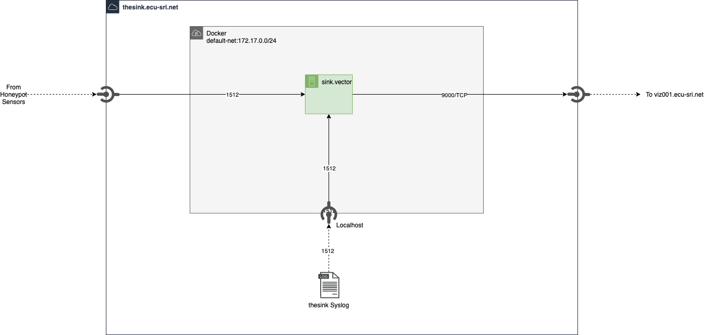
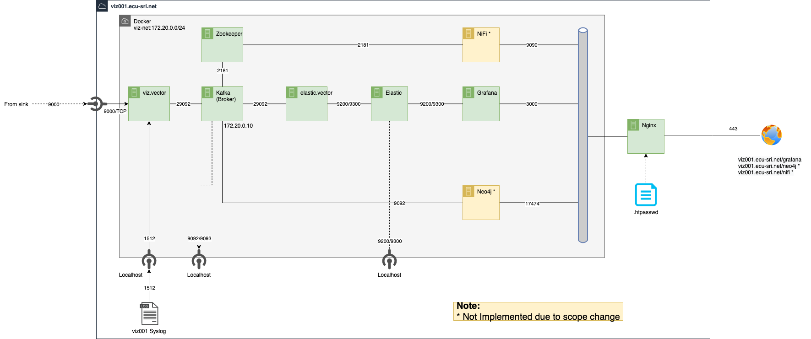

## Logical Overview

=== "**thesink.ecu-sri.net**"

    _Process_

    1. **thesink** ingests the honeypot sensors traffic on port 1512
    2. process **sink.vector** forwards to **viz001** over secure TLS port 9000

    _Detailed Diagram_
    

    !!! Note 
        To view drawing in full:

        Right click on image and open image in new tab

=== "**viz001.ecu-sri.net**"

    _Process_

    1. **viz001** ingests all syslog data on port 9000.
    2. **viz.vector** container performs tagging and initial processing on the raw data.
    3. all processed data is forwarded to **kafka broker** topic `logging.syslog.processed`. (tag=processed)
    4. all unprocessed data is forwarded to **kafka broker** topic `logging.syslog.raw`. (tag=raw)
    5. process **elastic.viz** consumes topic `logging.syslog.processed` and forwards to **elastic search** container.
    6. **elastic search** container indexes the field data into daily indexes, identified by: "syslog-%Y.%m.%d"
    7. **Grafana** container has elastic search configured as the default data source.  
    8. **nginx** reverse proxy provides access to the **grafana** container.
    9. Dashboard user access dashboards via <https://viz001.ecu-sri.net/grafana>.

    _Detailed Diagram_

    

    !!! Note 
        To view drawing in full:
        
        Right click on image and open image in new tab
