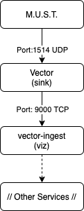

# docker-must

Docker container to generate syslog output for testing purposes.

```
M - More
U - Useful
S - Syslog
T - Testing tool
```

!!! Note
    For more information relating to using MUST, please see the MUST Project home page <https://sourceforge.net/p/mustsyslog/wiki/Home/>

## Flow of data



## Useful commands

### Confirm operation of container
- Observe if syslogs successfully being created

```
sudo docker inspect docker-must
```

### Begin creation of syslogs
- Syslogs that are created by must are high in volume. Starting the container will result in rapid logs being created. When the CI/CD pipeline runs, the docker remains in a 'stopped' state.

```
sudo docker start docker-must
```

### Halt creation of syslogs
- Syslogs that are created by must are high in volume. Stopping the container will halt the creation of logs. When the CI/CD pipeline runs, the docker remains in a 'stopped' state.

```
sudo docker stop docker-must
```
