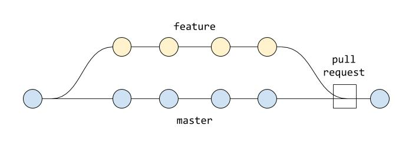

## Overview
Github is used as the git source repository to manage:

1. Project version control for all files.
2. Issue and Feature request management via the Issues page.
3. Change management tracking via Pull Requests.
4. QA via pre-commit hooks.
5. Continuous Integration (QA Testing) and Continuous Deployment (CICD) via Gihub Actions
6. Release Management via tagged releases

## Git Feature WorkFlow

This project uses git feature workflows where *issues* and *features* are developed in a seperate branch.

Once the issue or feature has been completed and tested it is merged into the master branch via a pull request.

Changes are automatically deployed to production on "Tagging" the master branch with a version number e.g. v1.0.1




## Actions

Github actions are used for the projects CICD

```
hpviz\
    .github\
        workflows\
            ansible-deploy.yml  # deployment action will only run after linting passes
            ansible-lint.yml    # pull request ansible linting
            main.yml            # general lint on push
```

## Pre-commit hooks

pre-commit hooks are used to run a number of locals tests before the commit occurs.  If any of the pre-commits tests fail then the commit will not occur until all tests pass.
