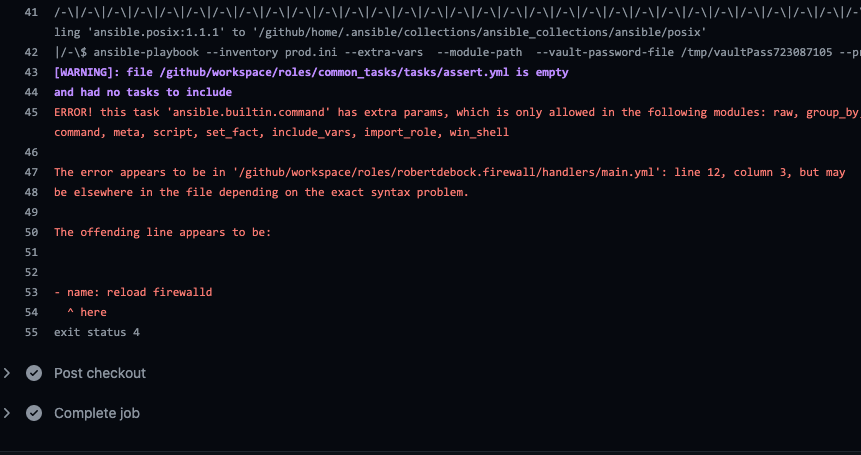

## Docker container issues

ssh into the host with issues and list teh running containers.  Problem containers will be constantly restarting. and have a _STATUS_ with a very low time

```bash
sudo docker container ls
```

!!! example "Example Output"
    ``` bash
    vagrant@dev-viz:~$ sudo docker container ls
    CONTAINER ID   IMAGE                                                     COMMAND                  CREATED       STATUS       PORTS                                                                  NAMES
    4120bca10da6   grafana/grafana:latest-ubuntu                             "/run.sh"                2 hours ago   Up 2 hours   127.0.0.1:3000->3000/tcp                                               grafana
    e6347d913259   timberio/vector:latest-alpine                             "/usr/local/bin/vect…"   2 hours ago   Up 2 hours                                                                          vector2elastic
    b49fc34fdb76   timberio/vector:latest-alpine                             "/usr/local/bin/vect…"   2 hours ago   Up 2 hours   1514/udp, 3514/udp, 127.0.0.1:1514->1514/tcp, 0.0.0.0:9000->9000/tcp   vector-ingest
    d7b035caed91   docker.elastic.co/elasticsearch/elasticsearch-oss:7.0.1   "/usr/local/bin/dock…"   2 hours ago   Up 2 hours   127.0.0.1:9200->9200/tcp, 127.0.0.1:9300->9300/tcp, 29300/tcp          elasticsearch
    d71d87f20842   confluentinc/cp-server:5.5.1                              "/etc/confluent/dock…"   2 hours ago   Up 2 hours   127.0.0.1:9092->9092/tcp, 29092/tcp                                    broker
    ca3ec0c0fa31   confluentinc/cp-zookeeper                                 "/etc/confluent/dock…"   2 hours ago   Up 2 hours   2181/tcp, 2888/tcp, 3888/tcp                                           zookeeper
    vagrant@dev-viz:~$
    ```

To view the problem containers logs

```bash
sudo docker container logs
```

## CICD Pipeline Errors

You will be notified of any pipeline errors via your github email address, additionally you can view current status under the projects github/actions page.


Click through on the red errors until the log is shown



## Kafka Broker

To monitor Kafka topics, a CLI utility, [kafkcat](https://docs.confluent.io/platform/current/app-development/kafkacat-usage.html),  has been installed on the broker host.

``` bash
kafkacat -b localhost:9092 -t logging.syslog.raw -o end   # monitors form the end of the topic
```

current topics in use:

- logging.syslog.raw
- logging.syslog.processed

!!! Example "Example kafkacat Output"
    ``` json
    root@viz001:~# kafkacat -C -b localhost -t logging.syslog.raw -o end
    % Reached end of topic logging.syslog.raw [0] at offset 139949727
    {"appname":"cowrie","facility":"user","host":"scada012","hostname":"scada012","message":"[SSHService 'ssh-connection' on HoneyPotSSHTransport,545129,5.188.62.236] direct-tcp connection request to 94.100.180.90:143 from 0.0.0.0:0","severity":"info","source_ip":"45.151.175.210","source_type":"syslog","tags":["syslog","json","raw"],"timestamp":"2021-03-10T12:05:01.285456Z","version":1}
    % Reached end of topic logging.syslog.raw [0] at offset 139949728
    {"appname":"cowrie","facility":"user","host":"scada012","hostname":"scada012","message":"[cowrie.ssh.factory.CowrieSSHFactory] New connection: 45.227.255.207:57372 (45.151.175.210:22) [session: 81748d18e817]","severity":"info","source_ip":"45.151.175.210","source_type":"syslog","tags":["syslog","json","raw"],"timestamp":"2021-03-10T12:05:02.076337Z","version":1}
    {"appname":"cowrie","facility":"user","host":"scada012","hostname":"scada012","message":"[HoneyPotSSHTransport,545139,45.227.255.207] Remote SSH version: 'SSH-2.0-Go'","severity":"info","source_ip":"45.151.175.210","source_type":"syslog","tags":["syslog","json","raw"],"timestamp":"2021-03-10T12:05:02.092546Z","version":1}
    {"appname":"cowrie","facility":"user","host":"scada012","hostname":"scada012","message":"[HoneyPotSSHTransport,545139,45.227.255.207] SSH client hassh fingerprint: eccf733a56108dec8ecc8efbc681be63","severity":"info","source_ip":"45.151.175.210","source_type":"syslog","tags":["syslog","json","raw"],"timestamp":"2021-03-10T12:05:02.257606Z","version":1}
    % Reached end of topic logging.syslog.raw [0] at offset 139949731
    {"appname":"cowrie","facility":"user","host":"scada012","hostname":"scada012","message":"[SSHService 'ssh-userauth' on HoneyPotSSHTransport,545139,45.227.255.207] login attempt [root/root] succeeded","severity":"info","source_ip":"45.151.175.210","source_type":"syslog","tags":["syslog","json","raw"],"timestamp":"2021-03-10T12:05:02.765731Z","version":1}
    % Reached end of topic logging.syslog.raw [0] at offset 139949732
    {"appname":"cowrie","facility":"user","host":"scada012","hostname":"scada012","message":"[SSHService 'ssh-connection' on HoneyPotSSHTransport,545139,45.227.255.207] direct-tcp connection request to 34.195.188.87:443 from 0.0.0.0:0","severity":"info","source_ip":"45.151.175.210","source_type":"syslog","tags":["syslog","json","raw"],"timestamp":"2021-03-10T12:05:03.289896Z","version":1}
    % Reached end of topic logging.syslog.raw [0] at offset 139949733
    ```

## Elastic Search

On the elastic serch host

### check indexes

```bash
curl http://localhost:9200/_cat/indices/?pretty&s=index
```

!!! example "Example Output"
    !!! Note
        status will always be __yellow__ on a single node elasticsearch host

    ```bash
    yellow open syslog-2020.12.28 -ta_Ddy-TkyMdeQNzvxung 1 1  339766 0  92.9mb  92.9mb
    yellow open syslog-2020.11.10 g1pUQEx9SHORQXr4kCnIUA 1 1 6765946 0 819.9mb 819.9mb
    yellow open syslog-2021.02.03 bwT_m283ROi9aSohoJ9fsg 1 1  214504 0  67.4mb  67.4mb
    yellow open syslog-2021.01.19 sVxCGEEBS4K9Bz6vUQEDKg 1 1  164703 0  49.4mb  49.4mb
    yellow open syslog-2021.02.23 y6syRNy_RiiQgFkWB-p3zg 1 1  148927 0  60.3mb  60.3mb
    yellow open syslog-2021.01.20 5nDJap01QkWeJfynAKaUgA 1 1  161877 0  47.6mb  47.6mb
    yellow open syslog-2020.12.21 n8jA5IW7Q-iom9ck3cFlXw 1 1  278862 0  76.2mb  76.2mb
    yellow open syslog-2021.02.26 57u_3SsDQV6559WfzVipTA 1 1  149529 0  56.1mb  56.1mb
    yellow open syslog-2021.01.23 ZuRpcEpRSwuW5smwwk3APg 1 1  175810 0  53.1mb  53.1mb
    yellow open syslog-2021.02.25 d3uhIHuDTBmUjHltWsKGhg 1 1  134976 0    51mb    51mb
    yellow open syslog-2020.10.29 2tML9d70Tumfri45XacBEA 1 1  227374 0  59.2mb  59.2mb
    yellow open syslog-2021.01.02 CkOFtSE8Rh2rviAxgMaApg 1 1  441296 0 109.6mb 109.6mb
    yellow open syslog-2020.10.28 3RjroHu1SU659cghDa8Ubg 1 1  335945 0  76.6mb  76.6mb
    yellow open syslog-2020.12.25 L9EhMpfnROun0gQ9JR1juw 1 1  318100 0  86.7mb  86.7mb
    yellow open syslog-2020.11.04 EBu8i2waQE-xAo6lU9yijg 1 1 2431622 0 327.7mb 327.7mb
    yellow open syslog-2020.12.01 JcjWKewxSya9EIYZPVAcwg 1 1  292791 0  81.6mb  81.6mb
    yellow open syslog-2021.03.04 pytHrdd8SkipvWmZzFUU5g 1 1   15070 0   8.3mb   8.3mb
    yellow open syslog-2021.01.25 OB3pjGsFQdK-Py6ssD6-QA 1 1  607549 0 130.3mb 130.3mb
    yellow open syslog-2020.11.25 sMGu7Vy_TByNcvtkCVzfMQ 1 1  246982 0  65.7mb  65.7mb
    yellow open syslog-2021.03.07 hmB3DkjXTCq_ugg5jCixLg 1 1   28383 0  12.4mb  12.4mb
    yellow open syslog-2021.02.07 _pGyOdMkR6GV6GLcYmfP0w 1 1  215615 0  71.6mb  71.6mb
    yellow open syslog-2020.10.16 -S55cmhMQomThbcXl-S2pA 1 1   16059 0   2.6mb   2.6mb
    yellow open syslog-2020.12.18 vlktfMlVQomT_3xEBc7NOA 1 1  281090 0  85.1mb  85.1mb
    yellow open syslog-2021.02.24 NFiyWs6NRCCSY0KRllT4Og 1 1  139388 0  52.6mb  52.6mb
    yellow open syslog-2021.02.28 LBjB64OCSA6_CTtab6kp-A 1 1   16255 0   9.7mb   9.7mb
    yellow open syslog-2020.10.14 BkfsrqIzRTmQGiQ7iVA1eg 1 1   39965 0   6.4mb   6.4mb
    yellow open syslog-2020.09.28 288Rxv3uQGS7xkOELfnOAA 1 1   73828 0  12.9mb  12.9mb
    yellow open syslog-2021.02.11 gRdlRjisSayhHO92soyUpQ 1 1  171350 0  65.2mb  65.2mb
    ^C
    [1]+  Done                    curl http://localhost:9200/_cat/indices/?pretty
    ```
